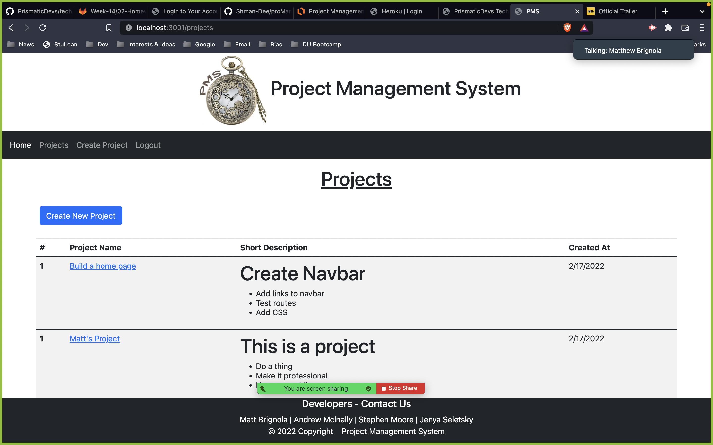
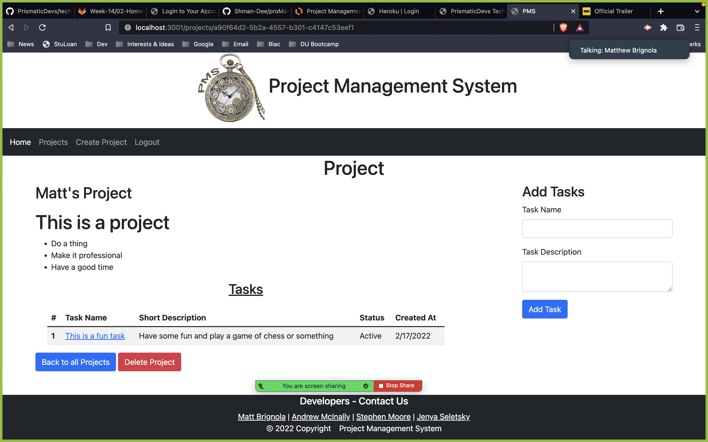

# Project Management System App

## Table of Contents

- [License](#license)
- [Description](#description)
- [Installation](#installation)
- [Usage](#instructions)
- [Contributors](#contributors)
- [Questions](#questions)

## License

## Description

This is a project management application to allow you to create projects, add user's, create project tasks, delete projects, and mark the status of whether a task has been completed or not.

The project was driven by the growing popularity of procrastination. With Project Management System you can reorganize your daily goals.

It was built to be a viable competitor against the hundreds of similar applications found of the web today.

Got problems? Not anymore! With our free, sleek, and simple approach to problem solving.

This project taught us that everyone has daily routines that need to be organized. The possibilities are endless and now are made more efficient.

## Installation

To run the Project Management System a user needs to simply sign up for an account.

## Usage
[Click here to view the live site deployed to Heroku](https://judo2000-pms.herokuapp.com/projects)  

PMS was made over long painstaking hours by an amazing team of developers. The application uses an array of technologies not limited to and including VSCode, HTML, CSS, JavaScript, Node.js, Postman, MySQL Workbench, a WYSIWYG editor and others.

## Contributors

Matthew Brignola, Andrew McInally, Stephen Moore, Jenya Seletsky, 

## Questions

Contact us:

<a class="hoverable" href="https://linktr.ee/matthewbrignola" target="_blank">Matt
Brignola</a> |
<a class="hoverable" href="https://linktr.ee/AndrewMcInally" target="_blank">Andrew
Mclnally</a> |
<a class="hoverable" href="https://linktr.ee/stephensmoore" target="_blank">Stephen Moore</a> |
<a class="hoverable" href="https://linktr.ee/jenya10016" target="_blank">Jenya
Seletsky</a>
